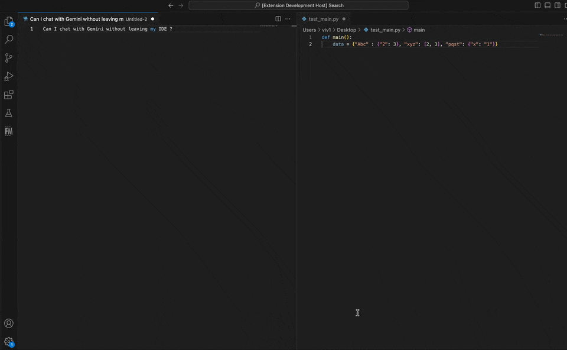

</a>

# Web Chat for Gemini

VSCode extension to interact with Gemini without leaving the IDE.

## Introduction

Have a quick question on your code or confused about the syntax ? Maybe you want to explore different ways to do a task. Or maybe you want a feedback on an image you are using, all **without spending a dime** ?

Using "**Web Chat for Gemini**", you can do all this, and more without leaving your VS code IDE. This extension gives you the ability to interact with the Gemini Pro APIs through your IDE. 

Google Generative AI Gemini pro APIs have **generous [free tier limits](https://ai.google.dev/pricing)**. You can even take advantage of the gemini multimodal LLM by uploading images along with your texts.

Ask the extension anything from generating code to getting feedback on your code to suggesting steps to earn money, and it will do it all for you.

Get your API key [here](https://aistudio.google.com/app/), and start harnessing the power.

## Features
- ✨ Powered by Gemini pro and pro vision APIs
- ✨ Provides relevant code and text outputs based on user inputs
- ✨ Remembers chat context and history, can carry long conversations
- ✨ Supports multi modal input (text and images)
- ✨ Supports multiple images as input
- ✨ Supports dark and light mode toggle
- ✨ Supports copy button to directly copy code snippets from response

## Installation
There are 2 ways to install:
1. Search for "Web Chat for Gemini" in the [VS Code Marketplace](https://marketplace.visualstudio.com/vscode), and install the extension. [Direct link to the extension](https://marketplace.visualstudio.com/items?itemName=wewake.webchatforgemini).
2. From within the VS code IDE, you can use the shortcut (*Ctrl+Shift+X for Linux/Windows, Cmd+Shift+X for Mac*) to open the Extension view and search for "Web Chat for Gemini" and install the extension.

## Usage
- After installation, open the command palette (*Ctrl+Shift+P for Linux/Windows, Cmd+Shift+P for Mac*) and type/select "Web Chat for Gemini", and click Enter. 

- This will open the "Web Chat for Gemini" in a new tab. On the top right side section, click the settings (⚙️) icon to where you can save your Gemini API key (Get your API key [here](https://aistudio.google.com/app/)).

- Use the input text area at the bottom to start the conversation. You can also use the file upload pin on the left of the input text area to upload any image. Click on "Send" to send the request.

(Suggestion: Assign a VS code shortcut key to open "Web Chat for Gemini" quickly.)

## Data Security
Your Gemini API Key stays stored locally (in VScode webview local storage, and in-memory). It is not stored anywhere else remotely. Also, all the chat conversations and communication is directly with the Gemini APIs. It is not tracked, or monitored by anything in between. Please feel free to check out the source code to validate this, if needed.

## License
This project is licensed under the MIT License.

## Contributing
Ways to help:

- File any new feature requests: Suggest features that'll help you utilize the extension more effectively.

- File any issues or bugs or feedback: Point out any issue with the functioning of the extension, or any discrepancy you have observed, or any general feedback you might have.

- Pick up open issues: Pick up and fix existing issues  by submitting a pull request on the Github repository.

## Support
For any inquiries or assistance, please contact hello@wewake.dev